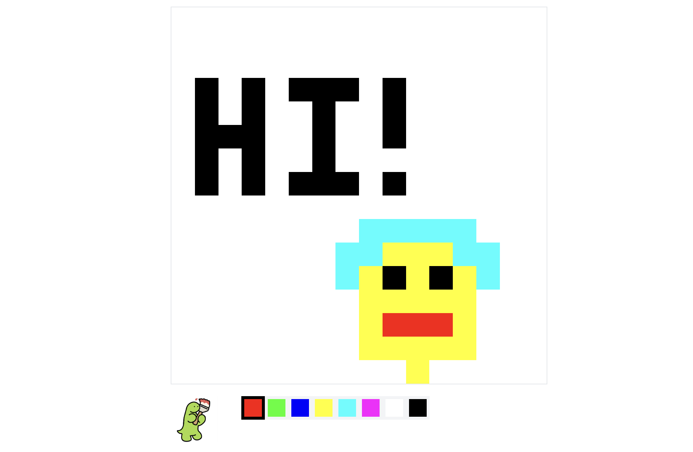

# pixelpage

Pixel page is an r/place style shared pixel art canvas. Users can place pixels
on the canvas, and all users can see the canvas update in real time.

## Features

- Real-time multiplayer canvas
- Global persistent canvas state using Deno KV
- Synchronizes game state between clients using BroadcastChannel
- Sends updates from server to clients using `EventSource` (server-sent events)

This project is hosted on Deno Deploy:

- Served from 35 edge locations around the world
- Scales automatically
- Data is a globally distributed Deno KV store with no setup required
- Code is deployed automatically when pushed to GitHub
- Automatic HTTPS (even for custom domains)
- Free for most hobby use cases

## Example

You can see a live example of the app running at https://pixelpage.deno.dev



## Running locally

To run the app locally, you will need to install Deno. Then run from the root of
this repository:

```sh
deno task start
```
